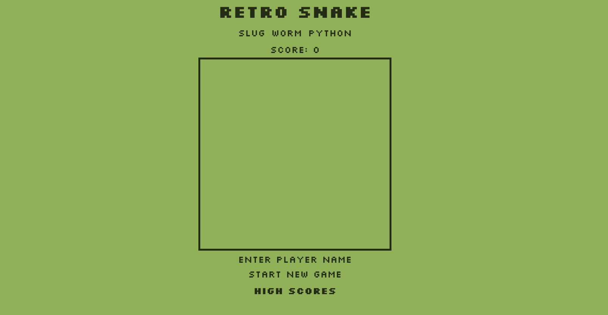
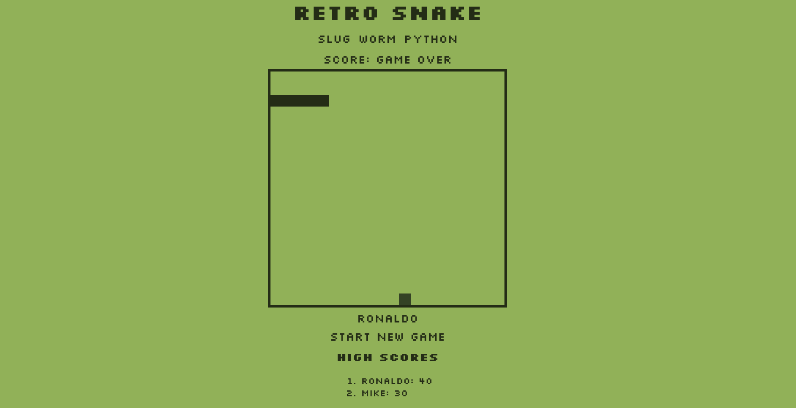

# `Retro Snake` 🐍
***

#### `Description` 📝
***
#### This is a simple pixel-based snake game implemented using HTML, CSS, and JavaScript. The player controls a snake on a grid-based board, aiming to eat food pellets to grow longer while avoiding collisions with the walls and the snake's own body. The game ends when the snake collides with a wall or itself. The player can enter their name to track their score, which is displayed alongside the top five high scores.

## [Retro Snake Planning Doc](https://docs.google.com/document/d/1bxekA2KsnJ2gmerSP6Huc8mbi2RH890KeZ64QKtCteI/edit?usp=sharing)⬅

## [Deploy game here](https://retro-snake-sdd.netlify.app/)🕹

## `Technologies used` 🖥

- HTML
- CSS
- JavaScript
- Netlify
- Git
- GitHub

## `Attributions` ❖

- I got my Favicon from [here](https://www.favicon.cc/)

## `Ice Box` ❄️

- [x] Add functionality to end game if snake colides with the game board
- [x] Add functionality to end game if snake colides with itself
- [x] Add score history that puts highest score on top
- Previous score list to display the last 5 scores
- [x] Buttons to change the game speed
- Dark mode
- Audio